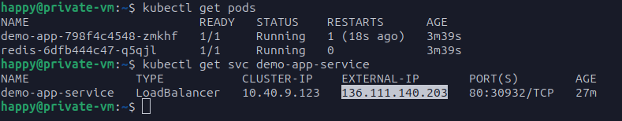
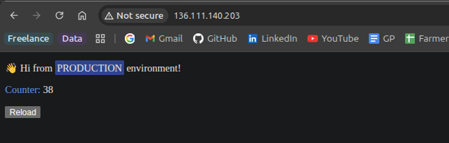

GCP-Terraform Project

## What this repo does

This repository contains Terraform modules to create a small GCP lab environment including a VPC, NAT, VM, firewall rules and a GKE cluster.

Network layout note: the project uses two subnets — a "management" subnet (where a private VM lives) and a "restricted" subnet which hosts the GKE cluster.

The Kubernetes application in this repo is provided as a single manifest (`k8s/deployment.yaml`) that contains both the Redis deployment + service and the application deployment + LoadBalancer service. The app image is not included in the repo; the manifest contains a placeholder `${IMAGE_URL}` which you must replace with your container image reference before applying (see instructions below).

## Prerequisites

- Install Terraform >= 1.6.0
- Install gcloud SDK and kubectl
- A Google Cloud project and credentials. You can either:
	- Authenticate via gcloud: `gcloud auth login` and `gcloud config set project <PROJECT_ID>`
	- Or set `GOOGLE_APPLICATION_CREDENTIALS` to a service account JSON file that has appropriate permissions.

Note: this repo contains a sample `terraform.tfvars` file. Edit variables if you need to change project/region.

## Quick deploy (terraform)

1. Initialize Terraform:

```bash
terraform init
```

2. Plan / Apply (uses `terraform.tfvars` in this repo):

```bash
terraform plan -var-file=terraform.tfvars
terraform apply -var-file=terraform.tfvars
```

If you want non-interactive apply:

```bash
terraform apply -var-file=terraform.tfvars -auto-approve
```

When `terraform apply` completes you'll have a GKE cluster. The module exports the cluster name as `gke_cluster_name` (use `terraform output`).

## Get credentials for kubectl

After apply, get the cluster name and then fetch credentials so `kubectl` points to the new cluster. Example (replace zone/project if different):

```bash
CLUSTER_NAME=$(terraform output -raw gke_cluster_name)
PROJECT_ID=$(terraform output -raw project_id 2>/dev/null || echo "$(cat terraform.tfvars | grep project_id | awk -F ' = ' '{print $2}' | tr -d '"')")
# if your cluster is zonal (default module value is us-central1-a), provide --zone
gcloud container clusters get-credentials "$CLUSTER_NAME" --zone us-central1-a --project "$PROJECT_ID"
```

If you used a different zone in `modules/gke/variables.tf`, replace `--zone` accordingly. You can also run `gcloud container clusters list --project $PROJECT_ID` to find cluster location.

## Deploy your app and Redis

This repo contains a single combined manifest at `k8s/deployment.yaml` that creates:
- a Redis Deployment + ClusterIP service named `redis`
- an application Deployment (uses `${IMAGE_URL}` placeholder) + a LoadBalancer Service named `demo-app-service`

Replace the `${IMAGE_URL}` placeholder and apply the manifest. Two easy options:

# 1) Edit the file directly
Open `k8s/deployment.yaml` and replace `${IMAGE_URL}` with your image reference (for example `gcr.io/<PROJECT>/demo-app:latest`), then:

```bash
kubectl apply -f k8s/deployment.yaml
```

# 2) Use envsubst to replace at apply time (no file edit)
Export the image variable then render and apply in one step:

```bash
export IMAGE_URL=gcr.io/<PROJECT>/demo-app:latest
envsubst < k8s/deployment.yaml | kubectl apply -f -
```

Notes:
- The Redis service created by the manifest is `redis` (ClusterIP). The application in the same manifest is already configured to use host `redis` and port `6379` via environment variables.
- Make sure the image you use is accessible by GKE nodes (public registry or Artifact Registry with proper permissions).

## Verify (get external IP and curl)

List services and wait for an external IP on the LoadBalancer service (it may take a minute or two):

```bash
kubectl get svc -o wide
# or target the python service specifically
kubectl get svc python-service
```

When the `EXTERNAL-IP` column shows an IP address (not `<pending>`), copy it and curl the app:

```bash
EXTERNAL_IP=<the-external-ip>
curl http://$EXTERNAL_IP:80/
```

If you used the `demo-http-echo.yaml` manifest it returns a small echo response and is useful to verify networking before you deploy your real app.

## Troubleshooting tips

- If terraform fails with permission errors, ensure the credentials used have required IAM roles (compute, container admin or equivalent).
- If `gcloud container clusters get-credentials` fails, check that the cluster name is correct and the project/zone flags are set.
- If the LoadBalancer IP stays in `<pending>` for a long time, check GCP console Networking > Load balancing for quota or issue details.


## Files in this repo you will use

- `k8s/deployment.yaml` — single combined manifest that deploys Redis (ClusterIP) and the application (LoadBalancer). Replace `${IMAGE_URL}` before applying (see section above).


---

When you run the steps and take photos of your `terraform apply` output and the `curl` to the external IP, attach them here and I can help interpret results or fix follow-up issues.

## Screenshots (placeholders)

Place your screenshots in the repository under the `screenshots/` directory using the exact filenames below (or overwrite the placeholder files that are included):

- `screenshots/01-deploy-pods-svc.png` — a screenshot showing `kubectl get pods` and `kubectl get svc` output (pods running and the `demo-app-service` and `redis` services visible).
- `screenshots/02-externalip-browser.png` — a screenshot of your browser showing the external IP/or the app page (or a terminal showing `curl http://<EXTERNAL-IP>` output).

How to replace them locally:

```bash
# copy your screenshots into the repo (example):
cp ~/Pictures/deploy-and-svc.png screenshots/01-deploy-pods-svc.png
cp ~/Pictures/externalip-browser.png screenshots/02-externalip-browser.png
git add screenshots/01-deploy-pods-svc.png screenshots/02-externalip-browser.png && git commit -m "Add deployment screenshots" && git push
```

Or simply attach the two images in this chat and I can inspect them directly.

### Embedded screenshots

If you committed the screenshot files to the `screenshots/` folder they will render below. If you don't see images here, make sure you've added and pushed the files named exactly as below.

Deploy + Pods/Service (kubectl output):



External IP / browser view (or curl output):



If images render as broken links, double-check the filenames and commit status locally (`git status`) and push the files to your remote repo so they are available in the repository view.
